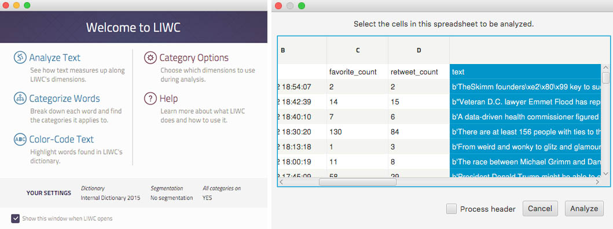
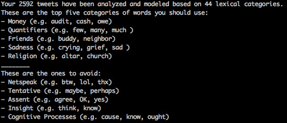
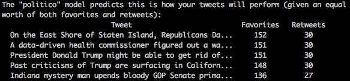

# Twitter Sentiment Analysis

This creates a model for tweets based on lexical categories and audience engagement. It analyzes past tweets to highlight high and low performing categories and compares tweets for maximum engagement.

## How does this work?
First, scrape tweets from a specific Twitter account using [scraper.py](scraper.py). This will get around 3,200 of the user's recent tweets. Next, run the .csv through [LIWC](https://liwc.wpengine.com/), which performs the sentiment analysis. Then, run [training.py](training.py) to create a model based on the analyzed tweets. Once you have the model, you can use the template in data/test/input to write potential tweets. Then run [test.py](test.py) to see which tweet scored the highest for potential engagement based on your sentiment analysis model. See Usage for more detailed use.

## Limitations
We tried to use [empath](https://github.com/Ejhfast/empath-client) to perform the sentiment analysis, but it wasn't giving us any meaningful conclusions. However, using [LIWC](http://liwc.wpengine.com/) requires a subscription, which costs $89.95 or $10.00 for a one-month trial.

## Installation

Create a virtualenv to store the codebase.
```bash
$ virtualenv twitter-sent-analysis
```

Activate the virtualenv.
```bash
$ cd twitter-sent-analysis
$ . bin/activate
```

Clone the git repository from GitHub.
```bash
$ git clone https://github.com/weimer-coders/twitter-sentiment-analysis repo
```

Enter the repo and install its dependencies.
```bash
$ cd repo
$ pip install -r requirements.txt
```

Make a copy of the credentials file to add your own [Twitter API](https://apps.twitter.com/) credentials
```bash
$ cp twitter-sent-analysis/credentials.template twitter-sent-analysis/credentials.py
```

## Quick Usage
**scraper.py**
```bash
$ python scraper.py [twitter_handle]
```

**training.py**
```bash
$ python training.py [twitter_handle]
```

**test.py**
```bash
$ python test.py [csv_file_to_test] [twitter_handle_of_model]
```
*Do not use file extensions or "@" for filenames or Twitter handles.*

## Walkthrough

### Gathering Twitter Data

The first thing to do is to find a Twitter account to analyze. We'll be using [Politico](https://twitter.com/politico) as a example for this README. However, when you run this, you should replace Politico each time with the username of your Twitter account. Once you have the Twitter account, run the scrape script passing the name of the account as an argument.
```bash
$ python scraper.py politico
```

This will create a file called `politico.csv` inside [data/train/scraped](data/train/scraped). The script grabs the text of the Tweet along with the number of favorites and retweets it has. Unfortunately replies aren't available through the free version of the Twitter API.

Next, pass this file through LIWC to analyze the lexical categories used in the text. Save the results as `politico.csv` inside the [data/train/analyzed](data/train/analyzed) directory. LIWC also renames the headers of your .csv file, so you'll need to enter the newly analyzed file and change the headings back to match those in the scraped directory.



### Training A Model

Once your text has been analyzed, you can train your machine learning model with it.

```bash
$ python training.py politico
```

This will give you a report indicating the most influential lexical categories (with some examples for each one). It will also save your model inside the [models](models) directory, which you can then use to test different tweets.



### Finding The Best Tweet

To test the quality of multiple tweets, you'll need to create a new .csv file using [the template](data/test/input/template) file. Fill out as many rows as you need (one row for each tweet). Then pass it through LIWC again to analyze the lexical categories. Save the results of that analysis in [data/test/analyzed](data/test/analyzed).

```python
# data/input/my_tweets.csv
text
"Past criticisms of Trump are surfacing in California and Texas as primary season heats up"
"A data-driven health commissioner figured out a way to slow overdose deaths. But treating addiction is a much harder problem"
"On the East Shore of Staten Island, Republicans Dan Donovan and Michael Grimm embrace the president in Trump country brawl"
"President Donald Trump might be able to get rid of special counsel Robert Mueller — but he can’t kill off the Russia probe"
"Indiana mystery man upends bloody GOP Senate primary"
```

Finally, run the test script to see which tweet your model believes will receive the highest level of engagement. This script takes two arguments. The first is the name of the file (we'll be using `my_tweets.csv` as an example). The second is the name of the saved model you'd like to test it with.


```bash
$ python test.py my_tweets politico
```



## Moving Forward

This analysis is meant to be a proof of concept and a first experiment in machine learning for the both of us. There are a number of upgrades that could be done to improve the quality of the engagement prediction such as the following:
- Using alternative forms of data gathering other than the Twitter API to get around the 3200 Tweet limit and to acquire the number of replies
- Scrape the headlines and description data that appears in Twitter cards in shared links as this is part of what the user sees and could effect engagement
- Separate scores into three dimensions (favorites, retweets, replies) and use a multi-dimensional regression algorithm to plot the relationship between the lexical categories and each engagement metric separately
